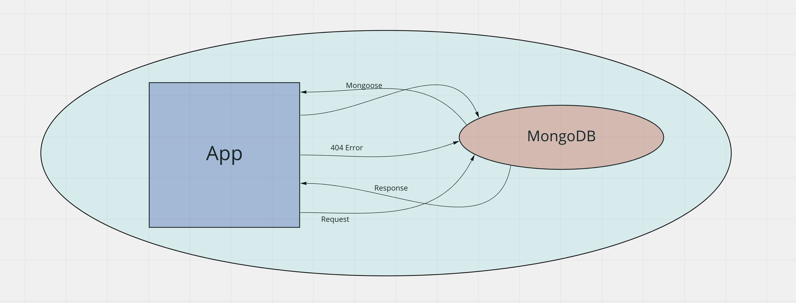

# api-server

Repository Name: api-server

Env: Node.js

Branch name: dev

This server is currently in use for the following front end projects:
1. Storefront
2. ToDo/Task Queue

Deployed Link: [https://api-server-jessi.herokuapp.com/](https://api-server-jessi.herokuapp.com/)

Routes:
- /store
- /todo
- /food
- /shoe

Github Actions: [https://github.com/JessiVelazquez/api-server](https://github.com/JessiVelazquez/api-server)

Pull Request: [https://github.com/JessiVelazquez/api-server/pull/3](https://github.com/JessiVelazquez/api-server/pull/3)

------------------------

